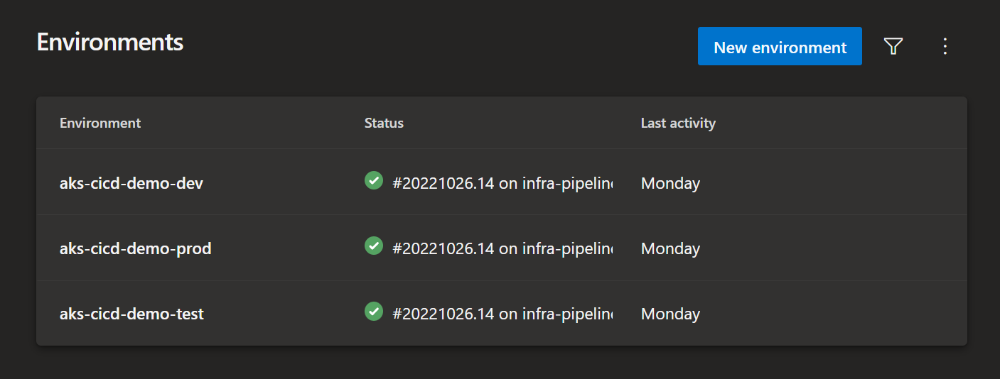

# Azure Kubernetes Service CI/CD Demo

## Overview
This repo demonstrates how to deploy networking infrastructure, Azure Kubernetes Service (AKS) clusters and the Azure voting app across 3 environments, dev, test & prod.

Three ADO pipelines each deploy a separate layer of the solution:
- Base networking infrastructure: ./pipelines/infra-pipeline.yaml
- AKS clusters: ./pipelines/aks-pipeline.yaml
- Azure Voting app: ./pipelines/workload-pipeline.yaml

## Pre-Requisites
- Azure DevOps Organization
- [Fork](https://docs.github.com/en/pull-requests/collaborating-with-pull-requests/working-with-forks/about-forks) this repository into your own GitHub account
- Create an Azure DevOps [GitHub Service Connection](https://learn.microsoft.com/en-us/azure/devops/pipelines/library/service-endpoints?view=azure-devops&tabs=yaml) to the forked repository
- Create 3 pipelines from the ./pipelines/*-pipeline.yaml files, in the Azure Devops portal
  - 'Project' -> 'Pipelines' -> 'New Pipeline' -> 'GitHub' -> '(your forked GitHub repo name)/aks-cicd-demo' -> 'Existing Azure Pipelines YAML file'
  - Repeat the above process to browse for each of the existing pipeline files
    - ./pipelines/infra-main.yaml
    - ./pipelines/aks-main.yaml
    - ./pipelines/workload-main.yaml
  - Rename each pipeline from its auto-generated name to whatever you want, but the names below are suggested
    - infra-pipeline
    - aks-pipeline
    - workload-pipeline
- Create 3 environments in the Azure Devops portal
  - aks-cicd-demo-dev
  - aks-cicd-demo-test
  - aks-cicd-demo-prod

## Deployment
- Run the the pipelines in the following oder:
  - infra-pipeline
  - aks-pipeline
  - workload-pipeline

## Testing
- The production environment will be exposed via an Azure Load Balancer
  - Get the production cluster's kubeconfig file
    - az aks get-credentials -n 'cluster name' -g prod-aks-rg --admin
  - Using the bash shell, get the public IP assigned to the 'azure-vote-front' service in the 'azure-vote' namespace 
    - EXTERNAL_IP=$(kubectl get svc azure-vote-front -n azure-vote --output jsonpath='{.status.loadBalancer.ingress[0].ip}')
  - Hit the endpoint using curl, or use a browser
    - curl http://$EXTERNAL_IP

