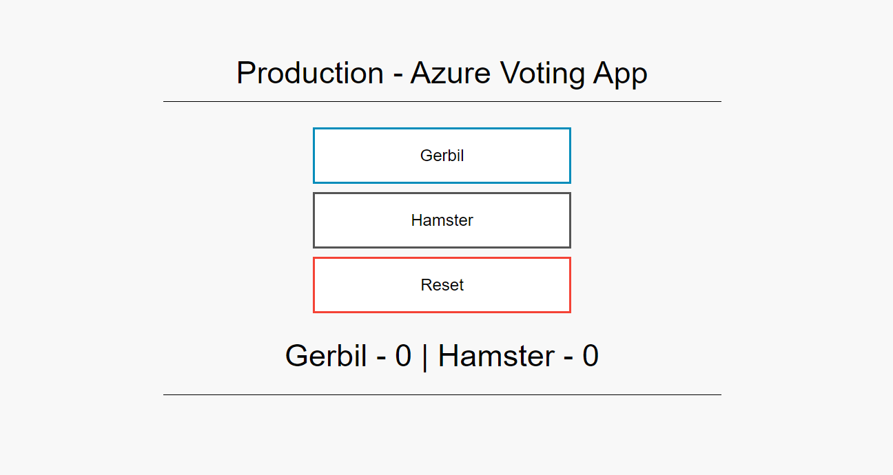

# Azure Kubernetes Service CI/CD Demo

## Overview
This repo demonstrates how to deploy networking infrastructure, Azure Kubernetes Service (AKS) clusters and the Azure voting app across 3 environments, dev, test & prod.

Three ADO pipelines each deploy a separate layer of the solution:
- Base networking infrastructure: ./pipelines/infra-pipeline.yaml
- AKS clusters: ./pipelines/aks-pipeline.yaml
- Azure Voting app: ./pipelines/workload-pipeline.yaml


## Pre-Requisites
- Azure DevOps (ADO) Organization
- Bash shell
- [Azure cli](https://learn.microsoft.com/en-us/cli/azure/install-azure-cli)
- [kubectl](https://kubernetes.io/docs/tasks/tools/)
- [Azure Devops cli](https://github.com/Azure/azure-devops-cli-extension)
  - Create an Azure Devops [Personal Access Token (PAT)](https://learn.microsoft.com/en-us/azure/devops/organizations/accounts/use-personal-access-tokens-to-authenticate?view=azure-devops&tabs=Windows#create-a-pat) for CLI authentication
  - Create a [GitHub access token](https://docs.github.com/en/authentication/keeping-your-account-and-data-secure/creating-a-personal-access-token)
- [Fork](https://docs.github.com/en/pull-requests/collaborating-with-pull-requests/working-with-forks/about-forks) this repository into your own GitHub account
- Create an Azure DevOps Service Connection to the forked repository
  - Azure Devops Portal
    - [Create a GitHub Service Connection](https://learn.microsoft.com/en-us/azure/devops/pipelines/library/service-endpoints?view=azure-devops&tabs=yaml)
  - Azure Devops cli
    ```
    $ az devops service-endpoint github create --name github-sep --github-url https://github.com/<your GitHub name> --organization https://dev.azure.com/<your ADO organization name> --project <your ADO project name>
    ```
    List the service connection and save the id in a variable
    ```
    $ GITHUB_CXN_ID=$(az devops service-endpoint list --query "[?contains(name, 'github-sep')] [id]" -o tsv)
    ```
- Create 3 pipelines from the ./pipelines/*-pipeline.yaml files, in the Azure Devops portal
  - Azure DewOps Portal
    - 'Project' -> 'Pipelines' -> 'New Pipeline' -> 'GitHub' -> '(your forked GitHub repo name)/aks-cicd-demo' -> 'Existing Azure Pipelines YAML file'
    - Repeat the above process to browse for each of the existing pipeline files
      - ./pipelines/infra-main.yaml
      - ./pipelines/aks-main.yaml
      - ./pipelines/workload-main.yaml
    - Rename each pipeline from its auto-generated name to whatever you want, but the names below are suggested
      - infra-pipeline
      - aks-pipeline
      - workload-pipeline
  - Azure Devops cli
    - Login using the Azure Devops cli. You will be prompted for the PAT created earlier.
    ```
    $ az devops login --organization https://dev.azure.com/<your ADO organization name>
    $ az devops configure --defaults organization=https://dev.azure.com/<your ADO organization name> project=<your ADO project name>
    ```
    - Import the pipeline YAML files
    ```
    $ az pipelines create --name 'infra-pipeline' --description 'Infrastructure Pipeline' --repository https://github.com/<your GitHub name>/aks-cicd-demo --branch main --yml-path ./pipelines/infra-pipeline.yml --service-connection $GITHUB_CXN_ID

    $ az pipelines create --name 'aks-pipeline' --description 'AKS Pipeline' --repository https://github.com/<your GitHub name>/aks-cicd-demo --branch main --yml-path ./pipelines/aks-pipeline.yml --service-connection $GITHUB_CXN_ID

    $ az pipelines create --name 'workload-pipeline' --description 'Workload Pipeline' --repository https://github.com/<your GitHub name>/aks-cicd-demo --branch main --yml-path ./pipelines/workload-pipeline.yml --service-connection $GITHUB_CXN_ID
    ```
- Create 3 environments (aks-cicd-demo-dev, aks-cicd-demo-test, aks-cicd-demo-prod)
  - Azure Devops portal
    - [Create a target environment](https://learn.microsoft.com/en-us/azure/devops/pipelines/process/environments?view=azure-devops)      
  - Azure Devops cli
    - currently there's no support to create new environments in the Azure Devops cli
    - Alternatively, use the [ADO REST API](https://learn.microsoft.com/en-us/rest/api/azure/devops/distributedtask/environments/add?view=azure-devops-rest-6.0)
    

## Deployment
- Run the the pipelines in the following oder:
  - infra-pipeline
  - aks-pipeline
  - workload-pipeline

## Testing
- The production environment will be exposed via an Azure Load Balancer
  - Get the production cluster's kubeconfig file
    ```
    $ az aks get-credentials -n 'cluster name' -g prod-aks-rg --admin
    ```
  - Using the bash shell, get the public IP assigned to the 'azure-vote-front' service in the 'azure-vote' namespace 
    ```
    $ EXTERNAL_IP=$(kubectl get svc azure-vote-front -n azure-vote --output jsonpath='{.status.loadBalancer.ingress[0].ip}')
    ```
  - Hit the endpoint using curl (or type 'http://<EXTERNAL_IP>' in a browser
    ```
    $ curl http://$EXTERNAL_IP
    ```


