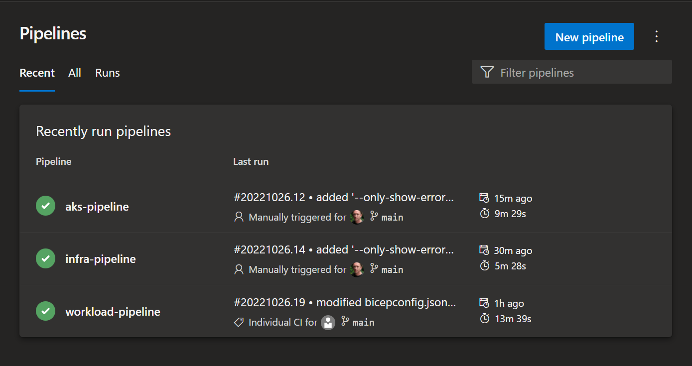
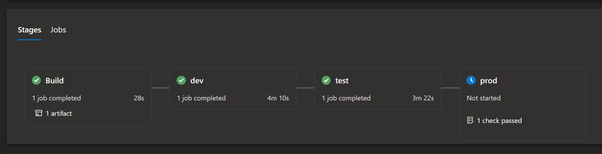

# Azure Kubernetes Service CI/CD Demo

## Overview
This repo demonstrates how to deploy networking infrastructure, Azure Kubernetes Service (AKS) clusters and the Azure voting app across 3 environments, dev, test & prod.

Three ADO pipelines each deploy a separate layer of the solution:
- Base networking infrastructure: ./pipelines/infra-pipeline.yaml
- AKS clusters: ./pipelines/aks-pipeline.yaml
- Azure Voting app: ./pipelines/workload-pipeline.yaml

## Pre-requisites
- Azure DevOps environment
- GitHub 
- Add the 'Run ARM TTK Tests (Cross Platform)' extension to your ADO project from the [Azure DevOps marketplace](https://marketplace.visualstudio.com)